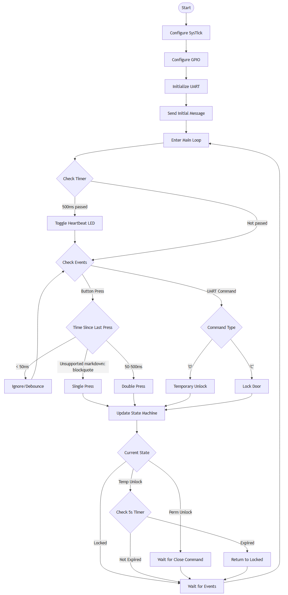

# Guía de Implementación: Sistema de Control de Acceso

## Introducción

Esta guía te ayudará a implementar un sistema de control de acceso utilizando un microcontrolador STM32L476RG. Configuraremos todo manualmente desde cero. El entorno de desarrollo es **Visual Studio Code** con la extensión STM32 y STM32CubeCLT.

El proyecto incluye:
* Una máquina de estados para controlar la puerta
* Comunicación UART (USART2)
* Control de LEDs y detección de eventos de botón
* Temporización usando SysTick


## Sección 0: Arquitectura del Dispositivo

Esytos diagramas fueron renderizados en [Structurizr](https://www.structurizr.com/dsl) con el siguiente script: [C4Model](assets/c4model.dsl)
### 0.1 Diagrama Contextual del Sistema

El siguiente diagrama contextual muestra la interacción entre el **Usuario**, el **PC**, y la **Nucleo Board**:


1. **Usuario**:
   - Envía comandos UART a través de una interfaz de terminal en el PC.
   - Presiona el botón físico para generar eventos en el sistema.
2. **PC**:
   - Interactúa con el sistema mediante el puerto USB para enviar comandos y visualizar mensajes de depuración.
3. **Nucleo Board**:
   - Recibe comandos del PC a través de la interfaz ST-Link.
   - Procesa entradas físicas (botón) y UART para controlar el estado del sistema.

---

### 0.2 Diagrama de Contenedores del Nucleo Board

El siguiente diagrama muestra la organización interna de la **Nucleo Board**, incluyendo los periféricos y las conexiones principales:


1. **Componentes principales**:
   - **ST-Link**:
     - Sirve como interfaz para depuración y comunicación UART/USB.
   - **STM32L476RG Microcontroller**:
     - Es el núcleo del sistema encargado de procesar entradas y manejar salidas.
   - **Periféricos físicos**:
     - **User Button (PC13)**: Entrada del sistema para generar eventos físicos.
     - **LED Heartbeat (PA5)**: Indica actividad del sistema.
     - **Door State LED (PA4)**: Muestra el estado de la puerta (bloqueado/desbloqueado).

---

### 0.3 Diagrama de Componentes del STM32

El siguiente diagrama detalla los componentes internos del microcontrolador STM32L476RG y sus interacciones:


1. **Entradas**:
   - **User Button (PC13)**: Genera eventos capturados por el componente **Button Handler**.
   - **ST-Link Debugger**: Convierte comandos USB en UART, procesados por el **UART Command Receiver**.

2. **Microcontrolador STM32**:
   - **Button Handler**: Captura eventos del botón y los pasa a la máquina de estados.
   - **UART Command Receiver**: Procesa comandos UART (`Open`, `Close`) y los envía a la máquina de estados.
   - **SysTick Timer**: Proporciona temporización basada en milisegundos para transiciones temporizadas de la máquina de estados.
   - **State Machine**:
     - Administra el estado del sistema: bloqueado, desbloqueo temporal, desbloqueo permanente.
     - Genera salidas hacia los LEDs y mensajes de depuración.
   - **UART Debug**: Envía información de depuración sobre transiciones de estado al PC.
   - **LED Handler**: Maneja los LEDs en función del estado actual del sistema.

3. **Salidas**:
   - **LED Heartbeat (PA5)**: Indica actividad del sistema.
   - **Door State LED (PA4)**: Representa el estado actual de la puerta.
   - **UART Debug**: Envía mensajes al terminal del PC para proporcionar información de depuración.

---

### 0.4 Diagramas de Código




## Sección 1: Creación del Proyecto

### 1.1 Abrir Visual Studio Code

Asegúrate de que la extensión **STM32 for VS Code** esté instalada.

### 1.2 Crear un Proyecto Vacío

0. Alternativamente puedes seguir los pasos de este video para [crear un proyecto vacío](https://www.youtube.com/watch?v=DDVdq47Dd94).
1. Abre la paleta de comandos con `Ctrl+Shift+P`
2. Escribe y selecciona **STM32: Create Empty Project**
3. Llena los parámetros:
   * **Project Name**: `4100901-Access_Control_System`
   * **Target Device**: `NUCLEO-L476RG`
   * **Project Location**: Elige la carpeta donde deseas guardar el proyecto

### 1.3 Estructura del Proyecto

1. Estructura inicial de archivos:
```
proyecto/
├── Inc/         # Archivos de cabecera (.h)
├── Src/         # Archivos fuente (.c)
├── Startup/     # Archivos de arranque
└── cmake/       # Configuración de CMake
```

2. Copia los archivos `.h` proporcionados en la carpeta `inc/`
3. Copia los archivos `.c` en la carpeta `src/`

4. Para agregar nuevos archivos fuente al proyecto:
   * Crea tu nuevo archivo `.c` en la carpeta `src/`
   * Crea tu nuevo archivo `.h` en la carpeta `inc/` (si es necesario)
   * Abre el archivo `cmake/vscode_generated.cmake`
   * Localiza la sección `sources_SRCS` y agrega tu nuevo archivo:
   ```cmake
   set(sources_SRCS ${sources_SRCS}
       ${CMAKE_CURRENT_SOURCE_DIR}/Src/main.c
       ${CMAKE_CURRENT_SOURCE_DIR}/Src/gpio.c
       # Agrega tu nuevo archivo aquí:
       ${CMAKE_CURRENT_SOURCE_DIR}/Src/mi_nuevo_archivo.c
   )
   ```

### 1.4 Compilar y Depurar el Proyecto

0. Alternativamente puedes seguir los pasos de este video para [compilar y depurar un proyecto](https://www.youtube.com/watch?v=yasF8z0BCzM).
1. Abre la paleta de comandos (`Ctrl+Shift+P`)
2. Selecciona **Tasks: Run Build Task** o presiona `Ctrl+Shift+B`
3. VS Code ejecutará la tarea de compilación definida en el archivo `tasks.json`

También puedes usar los botones de la barra inferior de VS Code:
* 🔨 (Build): Compila el proyecto
* 🔄 (Rebuild): Limpia y recompila todo el proyecto
* 🗑️ (Clean): Elimina los archivos compilados

#### Depuración usando VS Code

1. Conecta tu placa NUCLEO-L476RG al computador vía USB
2. En VS Code, ve a la vista de depuración (icono de insecto o `Ctrl+Shift+D`)
3. Selecciona la configuración "Cortex Debug" en el menú desplegable
4. Presiona F5 o el botón verde de "Play" para iniciar la depuración


## Sección 2: Configuración de Periféricos

### Configuración de RCC (Control de Relojes)

1. En el archivo `src/main.c`, incluye el archivo `rcc.h` para habilitar los relojes:

```c
#include "rcc.h"

void enable_clocks(void) {
    *RCC_AHB2ENR |= (1 << 0) | (1 << 2);  // GPIOA y GPIOC
    *RCC_APB1ENR1 |= RCC_APB1ENR1_USART2EN;  // USART2
}
```

2. Llama a `enable_clocks()` al inicio de `main()`:

```c
int main(void) {
    enable_clocks();
    
    while (1) {
        // Código principal
    }
}
```

### Configuración de GPIOs

1. En el archivo `gpio.c`, configura PA5 (LED) y PC13 (botón):

```c
#include "gpio.h"

void configure_gpio(void) {
    *RCC_AHB2ENR |= (1 << 0) | (1 << 2);  // Habilita GPIOA y GPIOC
    
    // Configura PA5 como salida
    GPIOA->MODER &= ~(3U << (5 * 2));  // Limpia los bits
    GPIOA->MODER |= (1U << (5 * 2));   // Modo salida
    
    // Configura PC13 como entrada
    GPIOC->MODER &= ~(3U << (13 * 2));  // Limpia los bits
}

void gpio_toggle_heartbeat_led(void) {
    GPIOA->ODR ^= (1 << 5);  // Alterna el LED
}
```

2. Llama a `configure_gpio()` desde `main()` después de habilitar los relojes:

```c
int main(void) {
    enable_clocks();
    configure_gpio();
    
    while (1) {
        gpio_toggle_heartbeat_led();
    }
}
```

### Configuración de SysTick

El temporizador SysTick se utiliza para implementar temporización basada en milisegundos.

1. En el archivo `systick.c`, configura el temporizador SysTick para trabajar con un reloj de 4 MHz:

```c
#include "systick.h"

volatile uint32_t ms_counter = 0;  // Contador global de milisegundos

void configure_systick_and_start(void) {
    SysTick->CTRL = 0x4;     // Desactiva SysTick para configuración
    SysTick->LOAD = 3999;    // Configuración para 1 ms (4 MHz reloj)
    SysTick->CTRL = 0x7;     // Activa SysTick
}

uint32_t systick_GetTick(void) {
    return ms_counter;  // Devuelve el tiempo en milisegundos
}

void SysTick_Handler(void) {
    ms_counter++;  // Incrementa el contador global cada 1 ms
}
```

Llama a configure_systick_and_start() al inicio de main():

```c
int main(void) {
    enable_clocks();
    configure_gpio();
    configure_systick_and_start();

    while (1) {
        gpio_toggle_heartbeat_led();
    }
}
```

### Configuración de UART
La UART (USART2) es utilizada para comunicación serial con comandos externos.

En el archivo uart.c, inicializa la USART2:
```c
#include "uart.h"

void usart2_init(void) {
    // Habilita el reloj para USART2
    *RCC_APB1ENR1 |= RCC_APB1ENR1_USART2EN;

    // Configura USART2
    USART2->CR1 &= ~USART_CR1_UE;       // Desactiva USART
    USART2->BRR = BAUD_9600_4MHZ;      // Configura velocidad (9600 baudios)
    USART2->CR1 |= USART_CR1_TE | USART_CR1_RE;  // Habilita TX y RX
    USART2->CR1 |= USART_CR1_UE;       // Activa USART
}
```

Implementa una función para enviar datos por UART:

```c
void usart2_send_string(const char *str) {
    while (*str) {
        while (!(USART2->ISR & USART_ISR_TXE));  // Espera hasta que TX esté listo
        USART2->TDR = *str++;
    }
}
```

Llama a usart2_init() en main() y envía un mensaje inicial:

```c
int main(void) {
    enable_clocks();
    configure_gpio();
    configure_systick_and_start();
    usart2_init();

    usart2_send_string("Sistema Inicializado\r\n");

    while (1) {
        gpio_toggle_heartbeat_led();
    }
}
```

## Sección 3: Implementación de la Máquina de Estados

La máquina de estados controla el estado de la puerta (bloqueado, desbloqueo temporal o desbloqueo permanente).

### 3.1 Definición de Estados

En el archivo `main.c`, define los estados y variables de control:

```c
typedef enum {
    LOCKED,
    TEMP_UNLOCK,
    PERM_UNLOCK
} DoorState_t;

DoorState_t current_state = LOCKED;
uint32_t unlock_timer = 0;
```

### 3.2 Implementación de la Máquina de Estados

Función principal que maneja la lógica de estados:

```c
void run_state_machine(void) {
    switch (current_state) {
        case LOCKED:
            // Sin acción en estado bloqueado
            break;
            
        case TEMP_UNLOCK:
            if (systick_GetTick() - unlock_timer >= 5000) { // 5 segundos
                gpio_set_door_led_state(0); // Apaga LED
                current_state = LOCKED;
            }
            break;
            
        case PERM_UNLOCK:
            // Sin acción en desbloqueo permanente
            break;
    }
}
```

### 3.3 Manejo de Eventos

Función para procesar eventos externos y cambiar estados:

```c
void handle_event(uint8_t event) {
    if (event == 1) {  // Pulsación simple
        usart2_send_string("Pulsación Simple\r\n");
        gpio_set_door_led_state(1);  // Enciende LED
        current_state = TEMP_UNLOCK;
        unlock_timer = systick_GetTick();
    }
    else if (event == 2) {  // Pulsación doble
        usart2_send_string("Pulsación Doble\r\n");
        gpio_set_door_led_state(1);  // Enciende LED
        current_state = PERM_UNLOCK;
    }
    else if (event == 'O') {  // Comando UART: Open
        usart2_send_string("Comando: Abrir\r\n");
        gpio_set_door_led_state(1);
        current_state = TEMP_UNLOCK;
        unlock_timer = systick_GetTick();
    }
    else if (event == 'C') {  // Comando UART: Close
        usart2_send_string("Comando: Cerrar\r\n");
        gpio_set_door_led_state(0);
        current_state = LOCKED;
    }
}
```

### 3.4 Integración en el Bucle Principal

Implementación completa en la función `main()`:

```c
int main(void) {
    enable_clocks();
    configure_gpio();
    configure_systick_and_start();
    usart2_init();
    
    usart2_send_string("Sistema Inicializado\r\n");
    
    uint32_t heartbeat_tick = 0;
    
    while (1) {
        if (systick_GetTick() - heartbeat_tick >= 500) {  // Latido cada 500 ms
            heartbeat_tick = systick_GetTick();
            gpio_toggle_heartbeat_led();
        }
        
        // Simular pulsaciones de botón
        uint8_t button_pressed = button_driver_get_event();
        if (button_pressed != 0) {
            handle_event(button_pressed);
        }
        
        // Simular comandos UART
        uint8_t rx_byte = usart2_get_command();
        if (rx_byte != 0) {
            handle_event(rx_byte);
        }
        
        run_state_machine();
    }
}
```
