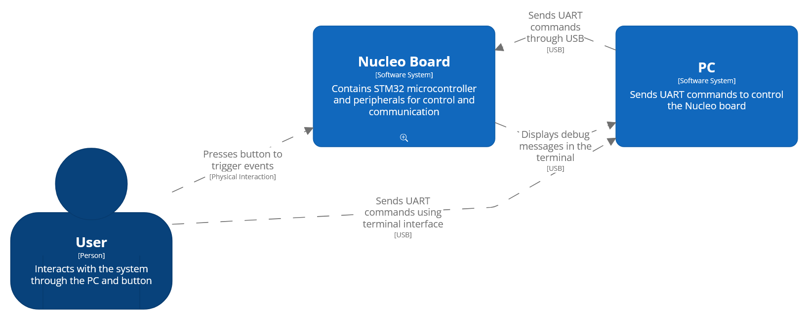
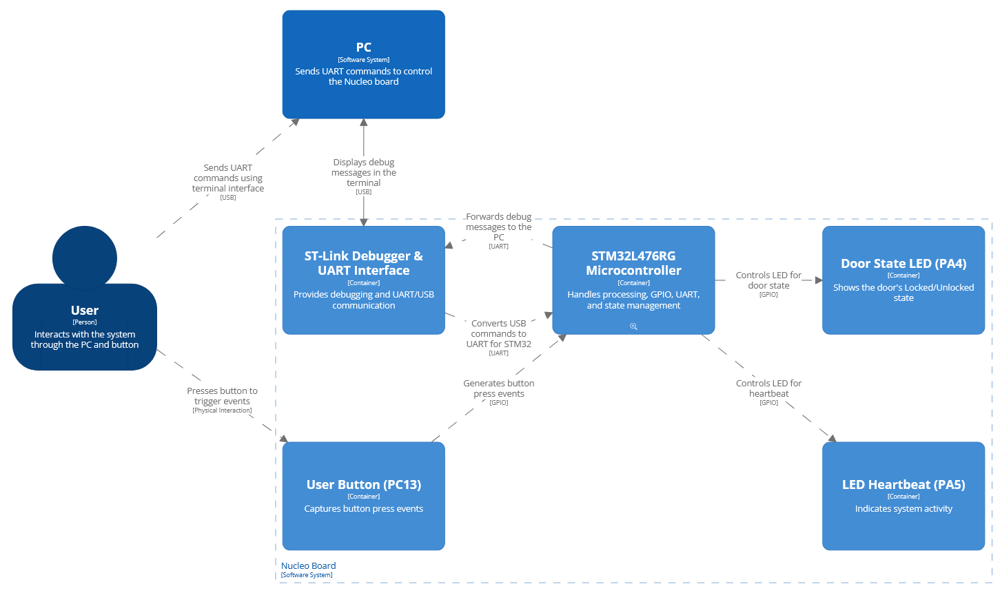
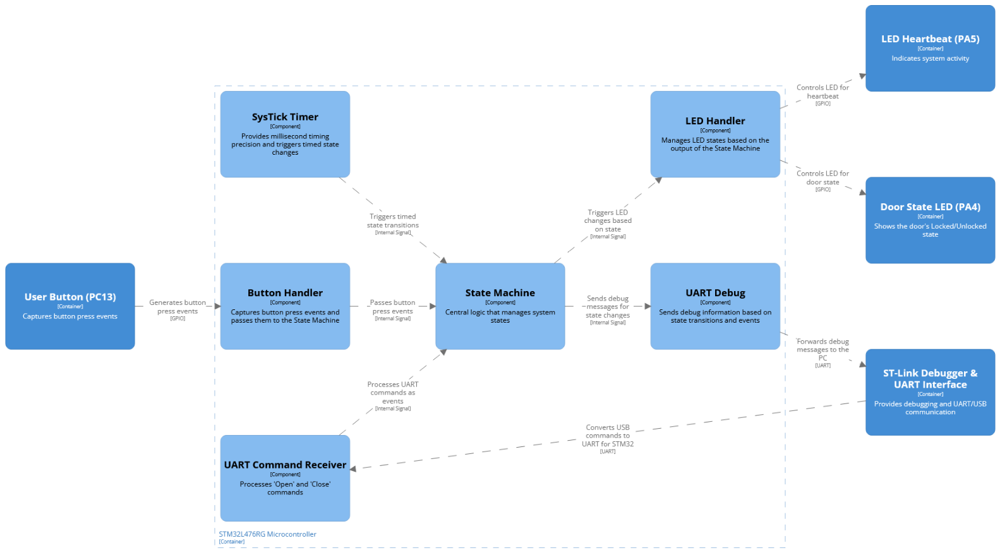
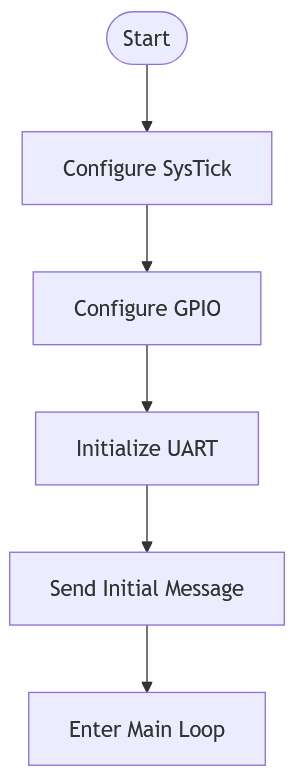
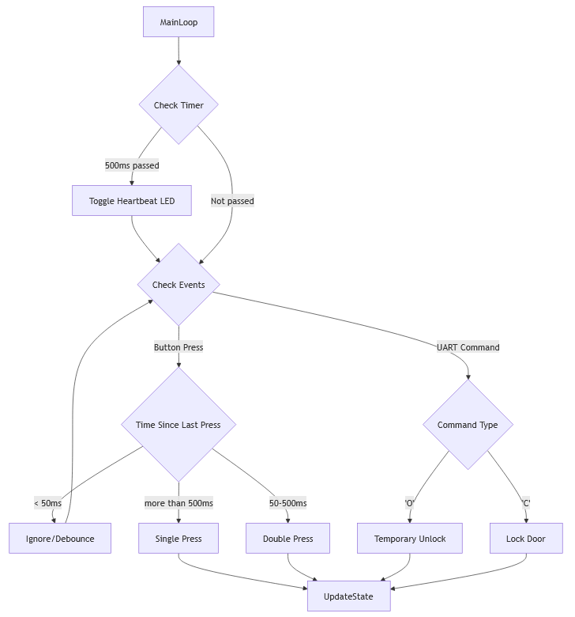
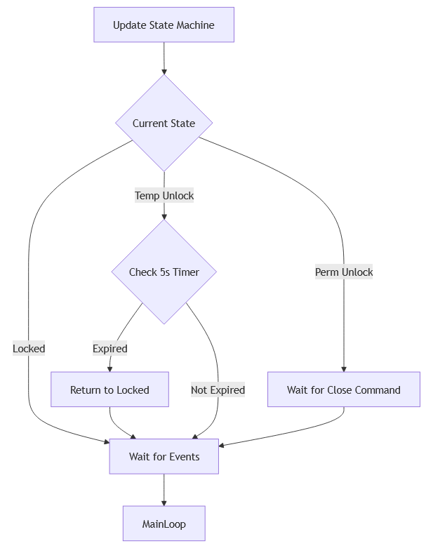

# Guía de Implementación: Sistema de Control de Acceso

## Introducción

Esta guía te ayudará a implementar un sistema de control de acceso utilizando un microcontrolador STM32L476RG. Configuraremos todo manualmente desde cero. El entorno de desarrollo es **Visual Studio Code** con la extensión STM32 y STM32CubeCLT.

El proyecto incluye:
* Una máquina de estados para controlar la puerta
* Comunicación UART (USART2)
* Control de LEDs y detección de eventos de botón
* Temporización usando SysTick


## Sección 0: Arquitectura del Sistema

Estos diagramas fueron renderizados en [Structurizr](https://www.structurizr.com/dsl) con el siguiente script: [C4Model](assets/c4model.dsl)

### 0.1 Diagrama Contextual del Sistema

El siguiente diagrama contextual muestra la interacción entre el **Usuario**, el **PC**, y la **Nucleo Board**:



---

### 0.2 Diagrama de Contenedores del Nucleo Board

El siguiente diagrama muestra la organización interna de la **Nucleo Board**, incluyendo los periféricos y las conexiones principales:



---

### 0.3 Diagrama de Componentes del STM32

El siguiente diagrama detalla los componentes internos del microcontrolador STM32L476RG y sus interacciones:



---

### 0.4 Diagramas de Código

Este diagrama fue renderizado en [Mermaid](https://mermaid.live) con el siguiente script: [flowchart.mermaid](assets/flowchart.mermaid)

1. **Inicialización:**



2. **Revisión de Eventos:**



3. **Máquina de Estados Finitos (FSM):**



## Sección 1: Creación del Proyecto

### 1.1 Abrir Visual Studio Code

Asegúrate de que la extensión **STM32 for VS Code** esté instalada y configurada con STM32CubeCLT.

### 1.2 Crear un Proyecto Vacío

0. Alternativamente puedes seguir los pasos de este video para [crear un proyecto vacío](https://www.youtube.com/watch?v=DDVdq47Dd94).
1. Abre la paleta de comandos con `Ctrl+Shift+P`
2. Escribe y selecciona **STM32: Create Empty Project**
3. Llena los parámetros:
   * **Project Name**: `4100901-Access_Control_System`
   * **Target Device**: `NUCLEO-L476RG`
   * **Project Location**: Elige la carpeta donde deseas guardar el proyecto

### 1.3 Estructura del Proyecto

1. Estructura inicial de archivos:
```
proyecto/
├── cmake/                 # Configuración de CMake
├── Inc/                   # Archivos de cabecera (.h)
├── Src/                   # Archivos fuente (.c)
├── Startup/               # Archivos de arranque
├── CMakeLists.txt         # Configuracion del proyecto
└── stm32l476rgtx_FLASH.ld # Configuracion de memorias
```

2. Para agregar nuevos archivos fuente al proyecto:
   * Crea el nuevo archivo `.c` en la carpeta `Src/`
   * Crea el nuevo archivo `.h` en la carpeta `Inc/`
   * Abre el archivo `cmake/vscode_generated.cmake`
   * Localiza la sección `sources_SRCS` y agrega tu nuevo archivo:
   ```cmake
   set(sources_SRCS ${sources_SRCS}
       ${CMAKE_CURRENT_SOURCE_DIR}/Src/main.c
       ${CMAKE_CURRENT_SOURCE_DIR}/Src/gpio.c
       # Agrega tu nuevo archivo aquí:
       ${CMAKE_CURRENT_SOURCE_DIR}/Src/nuevo_archivo.c
   )
   ```

### 1.4 Compilar y Depurar el Proyecto

#### Compilación

0. Alternativamente puedes seguir los pasos de este video para [compilar y depurar un proyecto](https://www.youtube.com/watch?v=yasF8z0BCzM).
1. Abre la paleta de comandos (`Ctrl+Shift+P`)
2. Selecciona **Tasks: Run Build Task** o presiona `Ctrl+Shift+B` y selecciona **CMAKE: Build**. *La -primera vez- te pedirá seleccionar `Debug`*
3. VS Code ejecutará la tarea de compilación definida en el archivo `tasks.json`

También puedes usar los botones de la barra inferior de VS Code:
* 🔨 (Build): Compila el proyecto
* 🔄 (Rebuild): Limpia y recompila todo el proyecto
* 🗑️ (Clean): Elimina los archivos compilados

#### Depuración

1. Conecta tu placa NUCLEO-L476RG al computador vía USB
2. En VS Code, ve a la vista de depuración (icono de insecto o `Ctrl+Shift+D`)
3. Selecciona la configuración "Cortex Debug" en el menú desplegable
4. Presiona F5 o el botón verde de "Play" para iniciar la depuración


## Sección 2: Configuración de Periféricos

La configuración de cualquier periférico sigue el patrón:
1. Habilitar Reloj
2. Configurar registros de periférico según se requiera.
3. Modificar los registros de entrada y salida para su uso.

### 2.1 Configuración de SysTick

El archivo `systick.c` implementa un temporizador basado en milisegundos:

```c
#include "systick.h"

typedef struct {
    volatile uint32_t CTRL;
    volatile uint32_t LOAD;
    volatile uint32_t VAL;
    volatile uint32_t CALIB;

} SysTick_t;

#define SysTick ((SysTick_t *)0xE000E010) // Base address of SysTick

volatile uint32_t ms_counter = 0; // Counter for milliseconds

void configure_systick_and_start(void)
{
    SysTick->CTRL = 0x4;     // Disable SysTick for configuration, use processor clock
    SysTick->LOAD = 3999;    // Reload value for 1 ms (assuming 4 MHz clock)
    SysTick->CTRL = 0x7;     // Enable SysTick, processor clock, no interrupt
}

uint32_t systick_GetTick(void)
{
    return ms_counter;
}

void systick_reset(void)
{
    ms_counter = 0;
}

void SysTick_Handler(void)
{
    ms_counter++;
}
```

Llama a `configure_systick_and_start()` en `main.c` para habilitar el temporizador.

### 2.2 Configuración de GPIO

El archivo `gpio.c` implementa la configuración para controlar el LED y el botón, además de configurar los pines para la UART y otras funciones utiles para el programa.

```c
#include "gpio.h"
#include "rcc.h"
#include "systick.h"

#define EXTI_BASE 0x40010400
#define EXTI ((EXTI_t *)EXTI_BASE)

#define EXTI15_10_IRQn 40
#define NVIC_ISER1 ((uint32_t *)(0xE000E104)) // NVIC Interrupt Set-Enable Register

#define SYSCFG_BASE 0x40010000
#define SYSCFG ((SYSCFG_t *)SYSCFG_BASE)

#define GPIOA ((GPIO_t *)0x48000000) // Base address of GPIOA
#define GPIOC ((GPIO_t *)0x48000800) // Base address of GPIOC

#define LED_PIN 5 // Pin 5 of GPIOA
#define BUTTON_PIN 13 // Pin 13 of GPIOC

void configure_gpio_for_usart(void)
{
    // Enable GPIOA clock
    *RCC_AHB2ENR |= (1 << 0);

    // Configure PA2 (TX) as alternate function
    GPIOA->MODER &= ~(3U << (2 * 2)); // Clear mode bits for PA2
    GPIOA->MODER |= (2U << (2 * 2));  // Set alternate function mode for PA2

    // Configure PA3 (RX) as alternate function
    GPIOA->MODER &= ~(3U << (3 * 2)); // Clear mode bits for PA3
    GPIOA->MODER |= (2U << (3 * 2));  // Set alternate function mode for PA3

    // Set alternate function to AF7 for PA2 and PA3
    GPIOA->AFR[0] &= ~(0xF << (4 * 2)); // Clear AFR bits for PA2
    GPIOA->AFR[0] |= (7U << (4 * 2));   // Set AFR to AF7 for PA2
    GPIOA->AFR[0] &= ~(0xF << (4 * 3)); // Clear AFR bits for PA3
    GPIOA->AFR[0] |= (7U << (4 * 3));   // Set AFR to AF7 for PA3

    // Configure PA2 and PA3 as very high speed
    GPIOA->OSPEEDR |= (3U << (2 * 2)); // Very high speed for PA2
    GPIOA->OSPEEDR |= (3U << (3 * 2)); // Very high speed for PA3

    // Configure PA2 and PA3 as no pull-up, no pull-down
    GPIOA->PUPDR &= ~(3U << (2 * 2)); // No pull-up, no pull-down for PA2
    GPIOA->PUPDR &= ~(3U << (3 * 2)); // No pull-up, no pull-down for PA3
}

void configure_gpio(void)
{
   *RCC_AHB2ENR |= (1 << 0) | (1 << 2); // Enable clock for GPIOA and GPIOC

    // Configure PA5 as output
    GPIOA->MODER &= ~(3U << (LED_PIN * 2)); // Clear mode bits for PA5
    GPIOA->MODER |= (1U << (LED_PIN * 2));  // Set output mode for PA5

    // Configure PC13 as input
    GPIOC->MODER &= ~(3U << (BUTTON_PIN * 2)); // Clear mode bits for PC13

    // Enable clock for SYSCFG
    *RCC_APB2ENR |= (1 << 0); // RCC_APB2ENR_SYSCFGEN

    // Configure SYSCFG EXTICR to map EXTI13 to PC13
    SYSCFG->EXTICR[3] &= ~(0xF << 4); // Clear bits for EXTI13
    SYSCFG->EXTICR[3] |= (0x2 << 4);  // Map EXTI13 to Port C

    // Configure EXTI13 for falling edge trigger
    EXTI->FTSR1 |= (1 << BUTTON_PIN);  // Enable falling trigger
    EXTI->RTSR1 &= ~(1 << BUTTON_PIN); // Disable rising trigger

    // Unmask EXTI13
    EXTI->IMR1 |= (1 << BUTTON_PIN);

    // Enable EXTI15_10 interrupt
    *NVIC_ISER1 |= (1 << (EXTI15_10_IRQn - 32));
    
}

// Emula el comprtamiento de la puerta
void gpio_set_door_led_state(uint8_t state) {
    if (state) {
        GPIOA->ODR |= (1 << 4); // encender LED estado puerta
    } else {
        GPIOA->ODR &= ~(1 << 4); // apagar LED estado puerta
    }
}

void gpio_toggle_heartbeat_led(void) {
    GPIOA->ODR ^= (1 << 5);
}

volatile uint8_t button_pressed = 0; // Flag to indicate button press
uint8_t button_driver_get_event(void)
{
    uint8_t event = button_pressed;
    button_pressed = 0;
    return event;

}

uint32_t b1_tick = 0;
void detect_button_press(void)
{
    if (systick_GetTick() - b1_tick < 50) {
        return; // Ignore bounces of less than 50 ms
    } else if (systick_GetTick() - b1_tick > 500) {
        button_pressed = 1; // single press
    } else {
        button_pressed = 2; // double press
    }

    b1_tick = systick_GetTick();
}

void EXTI15_10_IRQHandler(void)
{
    if (EXTI->PR1 & (1 << BUTTON_PIN)) {
        EXTI->PR1 = (1 << BUTTON_PIN); // Clear pending bit
        detect_button_press();
    }
}
```

Llama a `configure_gpio()` en `main.c` para inicializar los GPIOs.

### 2.3 Configuración de UART

El archivo `uart.c` implementa la configuración para la comunicación serial y algunas funciones para trasmisión y recepción de datos.

```c
#include "uart.h"
#include "rcc.h"
#include "nvic.h"
#include "gpio.h"

static volatile command_t last_command = CMD_NONE;

void usart2_init(void)
{
    configure_gpio_for_usart();

    *RCC_APB1ENR1 |= RCC_APB1ENR1_USART2EN;

    // 1. Desactivar la UART
    USART2->CR1 &= ~USART_CR1_UE;
    // 2. Configurar la velocidad de transmisión
    USART2->BRR = BAUD_9600_4MHZ;
    // 3. Configurar el número de bits de datos
    USART2->CR1 &= ~USART_CR1_M;
    // 4. Configurar el número de bits de parada
    USART2->CR2 &= ~USART_CR2_STOP;
    // 5. Habilitar Transmisor y Receptor
    USART2->CR1 |= USART_CR1_TE | USART_CR1_RE;
    // 6. Habilitar la UART
    USART2->CR1 |= USART_CR1_UE;

    // Activar interrupción de RXNE
    USART2->CR1 |= USART_CR1_RXNEIE; 
    NVIC->ISER[1] |= (1 << 6);
}

void usart2_send_string(const char *str)
{
    while (*str) {
        while (!(USART2->ISR & USART_ISR_TXE));
        USART2->TDR = *str++;
    }
}

command_t usart2_get_command(void)
{
    command_t cmd = last_command;
    last_command = CMD_NONE;
    return cmd;
}

void USART2_IRQHandler(void)
{
    uint32_t isr = USART2->ISR;
    if (isr & USART_ISR_RXNE) {
        char command = USART2->RDR;
        if (command == 'O') {
            last_command = CMD_OPEN;
        } else if (command == 'C') {
            last_command = CMD_CLOSE;
        }
    }
}

```

Llama a `usart2_init()` en `main.c` para inicializar la UART y utiliza `usart2_send_string()` para enviar datos.

### 2.4 Integración en el Código Principal

En el archivo `main.c`, asegúrate de integrar las configuraciones de los periféricos:

```c
int main(void) {
    configure_systick_and_start();
    configure_gpio();
    usart2_init();

    usart2_send_string("System Initialized\r\n");

    // [...Bucle principal del programa]
}
```

## Sección 3: Explicación del Bucle Principal y la Máquina de Estados

El bucle principal y la máquina de estados son el corazón del sistema:

### 3.1 Bucle Principal
El bucle principal está diseñado para ejecutar varias funciones críticas de manera continua:

1. **Heartbeat LED:** Se activa un LED intermitente cada 500 ms para indicar que el sistema está activo y funcionando.
2. **Eventos de Botón:** Detecta presiones de botones simples o dobles usando `button_driver_get_event()` y llama a la función `handle_event()` para procesarlos.
3. **Comandos UART:** Procesa datos recibidos vía UART, como los comandos "O" (abrir) y "C" (cerrar), y los gestiona con `handle_event()`.
4. **Máquina de Estados:** Administra las transiciones de estados según entradas de eventos o temporizadores mediante la función `run_state_machine()`.

```c
int main(void) {
    // [...Inicialización del sistema]

    uint32_t heartbeat_tick = 0;
    while (1) {
        if (systick_GetTick() - heartbeat_tick >= 500) {
            heartbeat_tick = systick_GetTick();
            gpio_toggle_heartbeat_led();
        }

        uint8_t button_pressed = button_driver_get_event();
        if (button_pressed != 0) {
            usart2_send_string("Button Pressed\r\n");
            handle_event(button_pressed);
            button_pressed = 0;
        }

        uint8_t rx_byte = usart2_get_command();
        if (rx_byte != 0) {
            usart2_send_string("Command Received\r\n");
            handle_event(rx_byte);
        }

        run_state_machine();
    }
}
```

### 3.2 Máquina de Estados
La máquina de estados se define con tres estados principales:

- **LOCKED:** La puerta está cerrada y no se realiza ninguna acción periódica.
- **TEMP_UNLOCK:** La puerta está desbloqueada temporalmente. Si el temporizador supera los 5000 ms, regresa al estado LOCKED.
- **PERM_UNLOCK:** La puerta está desbloqueada permanentemente hasta que se reciba un comando para cerrarla.

#### Implementación
La función `run_state_machine()` supervisa los estados y transiciones:

```c
void run_state_machine(void) {
    switch (current_state) {
        case LOCKED:
            // Estado cerrado: sin acción periódica
            break;
        case TEMP_UNLOCK:
            if (systick_GetTick() - unlock_timer >= TEMP_UNLOCK_DURATION) {
                gpio_set_door_led_state(0); // Apagar LED de estado
                current_state = LOCKED;
            }
            break;
        case PERM_UNLOCK:
            // Estado desbloqueado permanente: sin acción periódica
            break;
    }
}
```

La función `handle_event()` administra las entradas, como eventos de botones o comandos UART:

```c
void handle_event(uint8_t event) {
    if (event == 1) { // Presión simple
        usart2_send_string("Presión simple\r\n");
        gpio_set_door_led_state(1); // Encender LED
        current_state = TEMP_UNLOCK;
        unlock_timer = systick_GetTick();
    } else if (event == 2) { // Presión doble
        usart2_send_string("Presión doble\r\n");
        gpio_set_door_led_state(1); // Encender LED
        current_state = PERM_UNLOCK;
    } else if (event == 'O') { // Comando abrir
        usart2_send_string("Comando abrir recibido\r\n");
        gpio_set_door_led_state(1);
        current_state = TEMP_UNLOCK;
        unlock_timer = systick_GetTick();
    } else if (event == 'C') { // Comando cerrar
        usart2_send_string("Comando cerrar recibido\r\n");
        gpio_set_door_led_state(0);
        current_state = LOCKED;
    }
}
```


